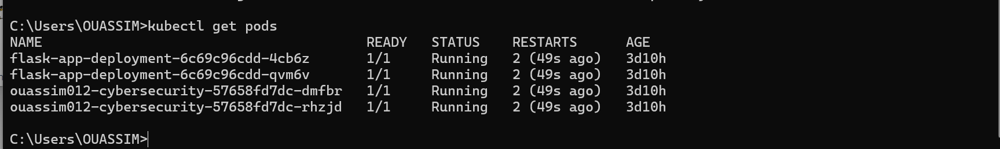
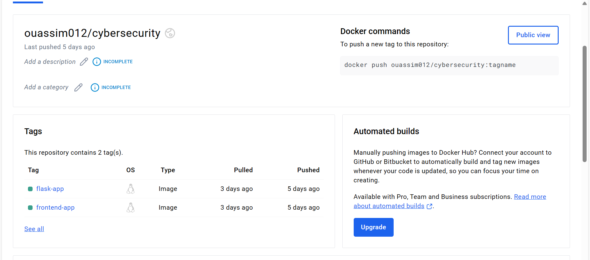
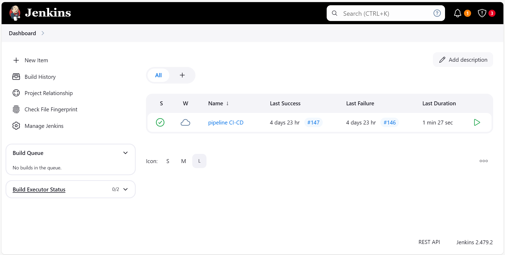
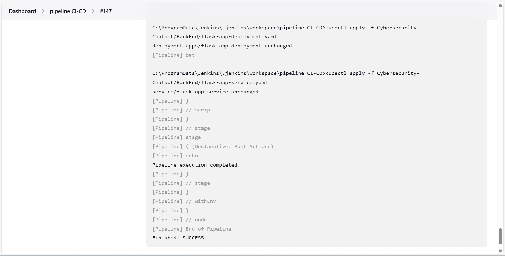
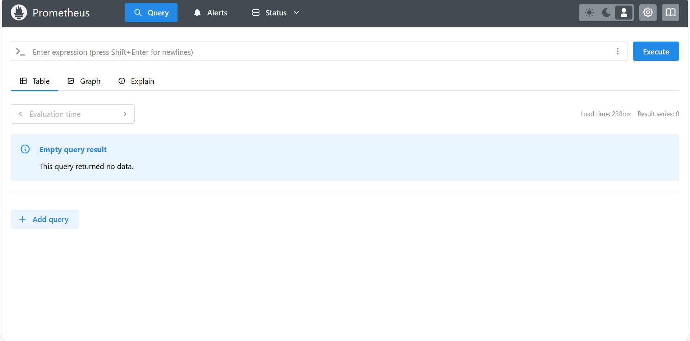
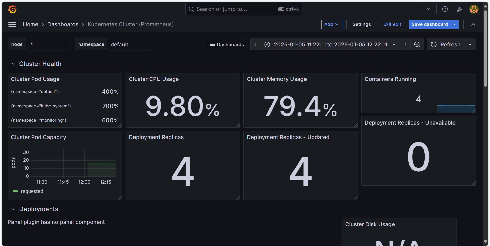
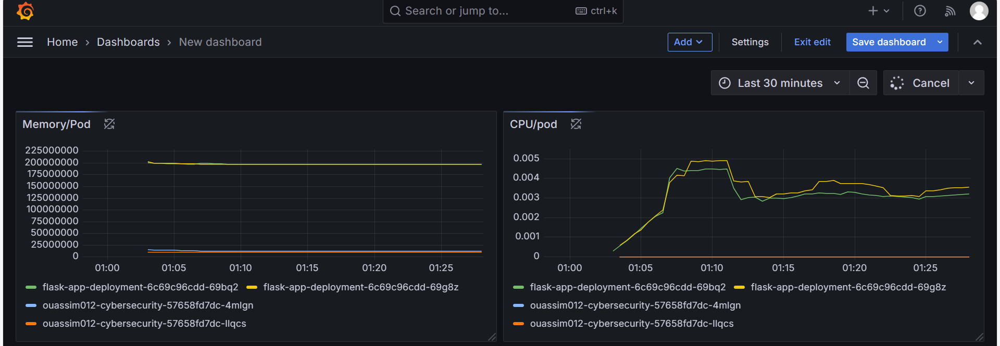

# Combining Diffusion Models and Language Understanding Models in a Cybersecurity Chatbot with Advanced Retrieval-Augmented Generation (RAG) Using a Microservices Architecture in a DevOps/MLOps Context

## Introduction
This project aims to enhance cybersecurity through a chatbot powered by Diffusion Models and Language Understanding Models. By integrating Advanced Retrieval-Augmented Generation (RAG) and utilizing a microservices architecture in a DevOps/MLOps context, we aim to provide an efficient, scalable, and intelligent chatbot solution for real-time cybersecurity threat management.

Key components of the project include:
- Diffusion Models for advanced generative capabilities.
- Language Understanding Models for effective user interaction.
- Retrieval-Augmented Generation (RAG) to improve response relevance.
- Microservices architecture for modularity and scalability.
- DevOps/MLOps practices for continuous integration, delivery, and deployment.

## Tasks Completed by Team Members

### Oumaima Echriyah
**Roles:** LLMs Responsible, Backend Developer, Frontend Developer

**LLMs Responsible:**
- Developed a **Retrieval-Augmented Generation (RAG)** system specifically for cybersecurity topics.
- Collected PDF datasets related to cybersecurity from trusted sources.
- Utilized **Python** for RAG system development.
- Integrated **Gemini** as the Language Model and **FAISS** as the Vector Database.
- Ensured accurate data indexing and retrieval.
- Key Functions for RAG:
    - `initialize_model`: Initializes the Gemini model with a specified configuration.
    - `load_vector_db`: Loads the FAISS vector database for similarity searches.
    - `get_conversational_chain`: Creates a conversational chain with predefined prompts.
    - `ask`: Handles user queries, retrieves relevant data, and generates responses.
      

**Backend Developer:**
- Developed a **Flask API** for seamless interaction with the RAG system.
  

**Frontend Developer:**
- Developed an Angular-based **chat interface** for the cybersecurity chatbot.

  

- Enabled users to ask cybersecurity-related questions interactively.
  
  
  
  
- Ensured clear error handling for queries unrelated to the cybersecurity dataset.

    

- Designed a user-friendly interface similar to modern chatbot designs.

Here's a detailed version of your roles and contributions:

---

### Ouassim Assoufi  

**Roles:** DevOps Responsible, CI/CD Responsible, Monitoring Responsible  

**DevOps Engineer:**  
- **Dockerization:**  
  - Built **Docker Images** for the Flask backend and Angular frontend and run them as containers, ensuring consistent and portable environments.
  -  
 
  - 
  - Wrote **Dockerfiles** for both applications, including dependencies and build instructions.  

- **Kubernetes Deployment:**  
  - Created **Kubernetes pods** for the Flask backend and Angular frontend, deploying them within a **Minikube cluster**.  
  - Developed **Deployment YAML files** for Flask and Angular with a **replica count of 2** to ensure high availability and fault tolerance.  
  - Configured **Service YAML files** using the **LoadBalancer** service type to expose the applications to external traffic.  
  - Validated deployments by checking pod status, endpoints, and ensuring services were reachable externally.  

**CI/CD Specialist:**  
- **Jenkins Pipeline:**  
  - Designed and implemented a **Jenkins pipeline** to automate the entire build, test, and deployment lifecycle.  
  - Authored a **Jenkinsfile** to:  
    - Clone the **GitHub repository** containing the Flask and Angular source code.  
    - Build Docker images for both applications.  
    - Push the Docker images to a docker-hub container registry.
    - 
    - Deploy the pods into the **Minikube cluster** using `kubectl` commands or configuration files.  

- Streamlined development and deployment workflows, reducing manual intervention and ensuring faster iteration cycles.  

---

**Monitoring Lead:**  
- **Prometheus Integration:**  
  - Configured **Prometheus** to scrape metrics from the Kubernetes cluster, focusing on:  
    - Resource utilization (CPU, memory) of Flask and Angular pods.  
    - Service availability and health.  
    - Cluster-wide metrics like node status and resource allocation.  

- **Grafana Visualization:**  
  - Set up **Grafana dashboards** for real-time visualization of system performance.  
  - Created custom panels to monitor:  
    - Flask and Angular pod metrics.  
    - Cluster resource usage.  
    
  

- Ensured continuous monitoring, enabling proactive issue detection and resolution.  

---

This version adds technical details to highlight your contributions and expertise in a professional and precise manner. Let me know if you'd like any further modifications!

### Hicham Fassali
Roles: Diffusion Model Responsible, MLops
**Diffusion Model:**  
This task aims to use diffusion models to generate tabular data and apply them to classification tasks, specifically for detecting whether an attack has occurred. The project involves several key steps to preprocess the data, train an appropriate diffusion model, and apply the model for attack classification.

1-Data Cleaning:

Removing duplicates: Identifying and removing duplicate records in the dataset.
Handling missing values: Addressing missing data through appropriate strategies (imputation, removal, etc.).
Feature selection: Using the correlation matrix to identify and remove highly correlated columns, which helps reduce redundancy and improve model performance.

2-Creating the Diffusion Model:

A diffusion model is created to generate new tabular data using a stochastic process that learns from the relationships between different variables in the dataset.

Key components:
Noise schedule: Defines how noise is added over steps.
Random timesteps: Selects random time steps for the diffusion process.
Gaussian noise: Adds Gaussian noise to the data.
p_sample_gauss: Uses model output to reverse noise and produce clean data.

Training Setup:
Optimizer: Adam optimizer is used for training the model.
Learning Rate Scheduler: Cosine annealing is used for adjusting the learning rate over time.
Loss Function: Mean Squared Error (MSE) for calculating the error between predictions and actual values.

The quality of the synthetic data generated by the model is assessed with an overall score, which combines various aspects such as column shapes and column pair trends. In this case, the model achieves an overall score of 94.68%, based on evaluations of:

Column Shapes: 96.19%
Column Pair Trends: 93.16%

3-Attack Classification:

Once the data is processed, a classification model is built to determine whether an attack is present or not.
The diffusion model generates tabular features that are then used to train a classifier (e.g., decision tree, logistic regression, or neural network) to detect the presence of attacks.

### Abghouni Amal
*Details to be added.*

## Conclusion
This project successfully combines cutting-edge technologies like Diffusion Models, Language Understanding Models, and Retrieval-Augmented Generation (RAG) to create a cybersecurity chatbot that can effectively respond to real-time threats. The use of a microservices architecture ensures scalability, while the adoption of DevOps/MLOps practices enables smooth deployment and continuous improvement. Our next steps include refining the models, improving the chatbot's ability to understand complex cybersecurity issues, and optimizing its integration with live systems.

